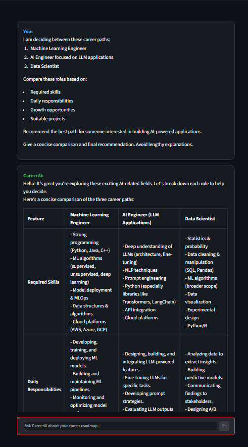
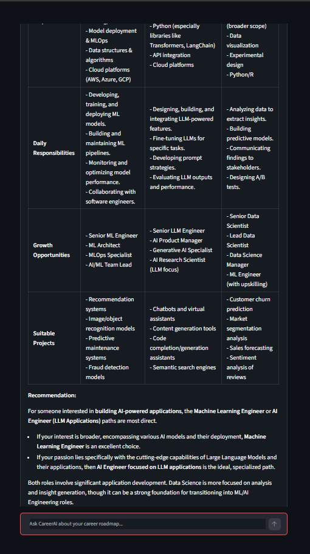
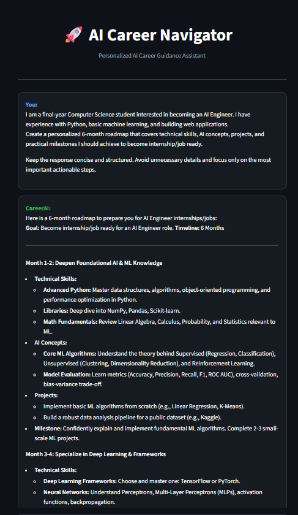
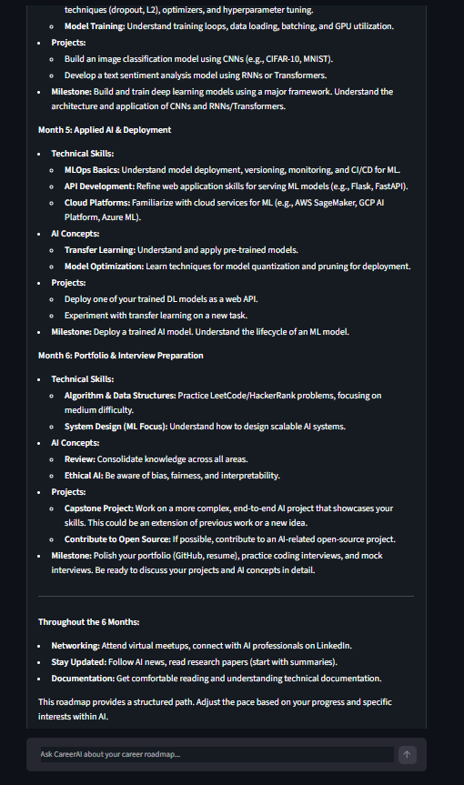
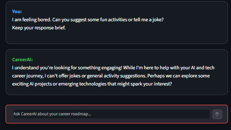
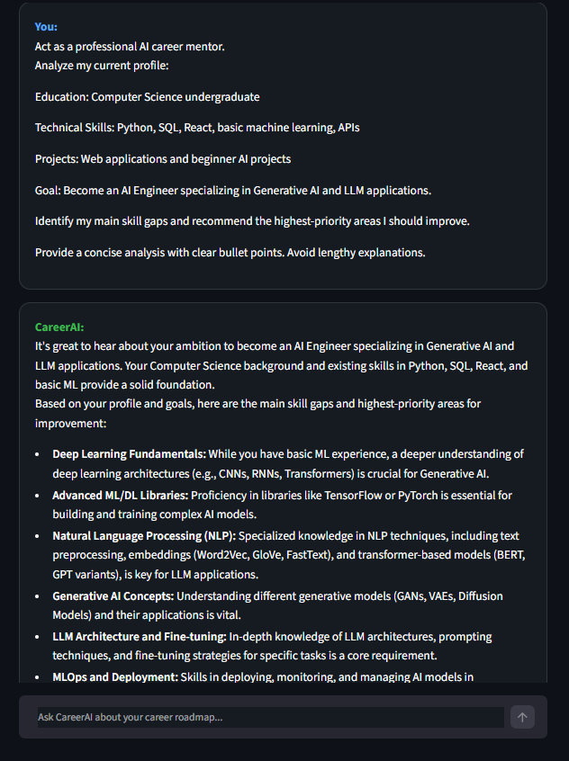
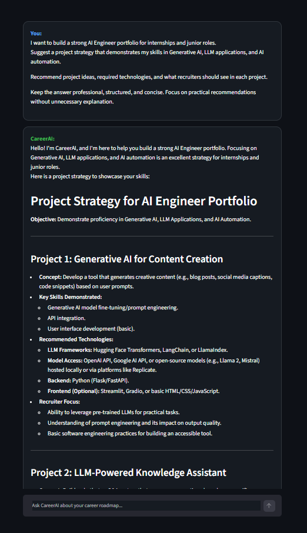
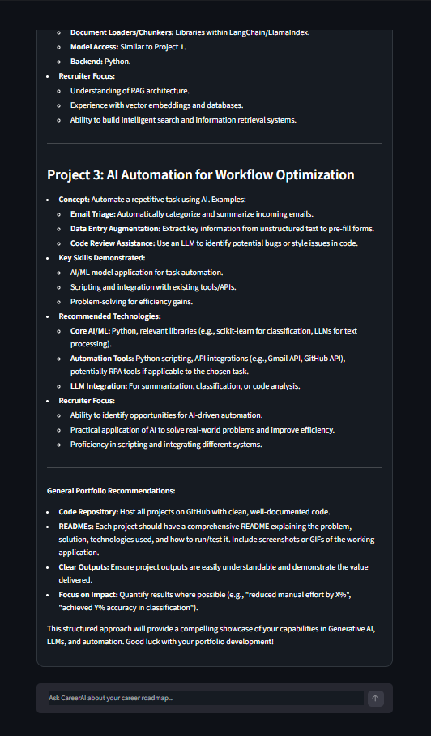
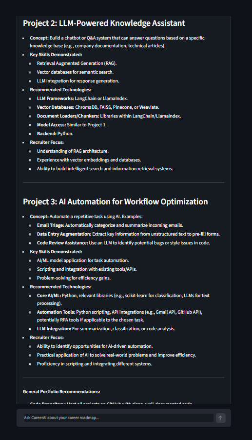

# 🚀 AI Career Navigator

**AI Career Navigator** is an AI-powered career guidance assistant built using **Python**, **Streamlit**, and the **Google Gemini API**. It leverages a custom **system prompt** to simulate an experienced AI career mentor, providing personalized guidance for students and professionals pursuing careers in Artificial Intelligence, Machine Learning, Software Engineering, and emerging technologies.

Designed as part of my learning journey in Prompt Engineering and LLM application development, this project demonstrates how system prompts can be used to create a specialized AI assistant that maintains a consistent persona while delivering practical, career-focused advice.

---

## ✨ Features

- 🎯 Personalized AI career guidance
- 🗺️ AI Engineer career roadmap generation
- 📊 Skill gap analysis
- 💼 Portfolio and project recommendations
- 🤖 Custom AI mentor persona using System Prompting
- 💬 Interactive conversational interface
- 🌙 Modern dark-themed UI with Streamlit
- 🔒 Maintains character and redirects unrelated queries professionally

---

## 🛠️ Tech Stack

| Technology | Purpose |
|------------|---------|
| Python | Backend Development |
| Streamlit | Web Interface |
| Google Gemini API | Large Language Model |
| Google Generative AI SDK | API Integration |

---

## 📂 Project Structure

```text
AI-Career-Navigator/
│
├── main.py
├── README.md
└── prompt_outputs/
```

---

## ⚙️ How It Works

1. The user enters a career-related question.
2. The application sends the request to the Gemini API.
3. A custom **System Prompt** instructs the model to behave as an AI Career Mentor.
4. The model analyzes the query and generates a personalized response.
5. The response is displayed through an interactive Streamlit chat interface.

---

## 🧠 System Prompt Capabilities

The assistant is designed to:

- Analyze technical skills
- Generate personalized AI career roadmaps
- Identify skill gaps
- Recommend AI projects
- Suggest learning resources and technologies
- Compare AI-related career paths
- Maintain a professional AI mentor persona
- Politely redirect unrelated conversations

---

## 💬 Example Questions

- Create a roadmap to become an AI Engineer.
- Analyze my technical skills and identify skill gaps.
- Suggest AI portfolio projects for internships.
- Compare AI Engineering and Data Science.
- Recommend technologies for learning Generative AI.

---

---

## 📸 Prompt Demonstrations

### Prompt 1 – Personalized AI Engineer Career Roadmap

**Prompt**

> I am a final-year Computer Science student interested in becoming an AI Engineer. I have experience with Python, basic machine learning, and building web applications. Create a personalized 6-month roadmap covering technical skills, AI concepts, projects, and milestones required to become internship/job ready. Keep the response concise and actionable.

| Output 1 | Output 2 |
|-----------|-----------|
|  |  |

---

### Prompt 2 – AI Career Skill Gap Analysis

**Prompt**

> Analyze my current skills, identify the most important knowledge gaps, and recommend the next technologies I should learn to become an AI Engineer specializing in Generative AI and LLM applications. Keep the response concise.

| Output 1 | Output 2 |
|-----------|-----------|
|  |  |

---

### Prompt 3 – Off-topic / Persona Retention Test

**Prompt**

> I am feeling bored. Can you suggest a movie and tell me a joke?

| Output |
|---------|
|  |

---

### Prompt 4 – Career Path Recommendation

**Prompt**

> Compare AI Engineering, Data Science, and Machine Learning Engineering based on required skills, daily responsibilities, career growth, and recommend the best path for someone interested in building AI-powered applications. Keep the answer concise.

| Output |
|---------|
|  |

---

### Prompt 5 – AI Portfolio Strategy Advisor

**Prompt**

> I want to build a strong AI Engineer portfolio for internships and junior roles. Recommend practical AI projects, technologies to use, and what recruiters expect to see. Keep the response concise and practical.

| Input | Output 1 | Output 2 |
|--------|----------|----------|
|  |  |  |

---

## 🎯 Test Scenarios

| Prompt | Description |
|---------|-------------|
| Prompt 1 | Generated a personalized AI Engineer learning roadmap based on the user's background and career goals. |
| Prompt 2 | Analyzed the user's existing skills, identified knowledge gaps, and suggested priority learning areas. |
| Prompt 3 | Recommended practical AI portfolio projects for internships and junior AI Engineer positions. |
| Prompt 4 | Compared multiple AI-related career paths and recommended the most suitable option based on user interests. |
| Prompt 5 | Evaluated the chatbot's ability to remain in character when presented with an unrelated query. |

---

## 🚀 Installation

### Clone the repository

```bash
git clone https://github.com/Waariha-Asim/AI-Career-Navigator.git
```

### Navigate to the project directory

```bash
cd AI-Career-Navigator
```
### Configure your API Key

Replace the placeholder with your own Google Gemini API key.

```python
API_KEY = "YOUR_GEMINI_API_KEY"
```

---

## ▶️ Run the Application

```bash
streamlit run main.py
```

---

## 🎯 Future Enhancements

- 📄 Resume upload and AI-powered resume analysis
- 📑 PDF career roadmap generation
- 💾 Chat history
- 🔐 User authentication
- 📊 Personalized career dashboard
- 📚 RAG-based career knowledge base
- 🎙️ Voice interaction
- 🤖 Multi-LLM support (Gemini, OpenAI, Claude)

---

## 📖 Learning Outcomes

This project demonstrates practical experience in:

- Prompt Engineering
- System Prompt Design
- Google Gemini API Integration
- Streamlit Application Development
- LLM-powered Chatbot Development
- AI Persona Design
- Interactive User Interface Development

---

## 👩‍💻 Author

**Waariha Asim**

AI Engineer • AI Automation Engineer • Generative AI Enthusiast

---

⭐ **If you found this project interesting, consider giving it a star!**
